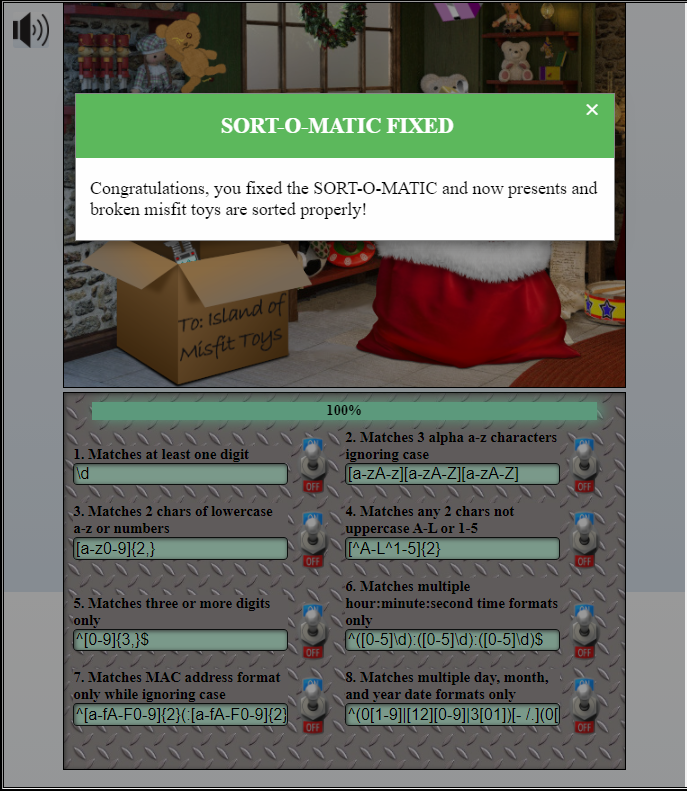

## Sort-O-Matic

```
1. Matches at least one digit
\d

2. Matches 3 alpha a-z characters ignoring case
[a-zA-z][a-zA-Z][a-zA-Z]

3. Matches 2 chars of lowercase a-z or numbers
[a-z0-9]{2,}

4. Matches any 2 chars not uppercase A-L or 1-5
[^A-L^1-5]{2}

5. Matches three or more digits only
^[0-9]{3,}$

6. Matches multiple hour:minute:second time formats only
^([0-5]\d):([0-5]\d):([0-5]\d)$

7. Matches MAC address format only while ignoring case
^[a-fA-F0-9]{2}(:[a-fA-F0-9]{2}){5}$

8. Matches multiple day, month, and year date formats only
^(0[1-9]|[12][0-9]|3[01])[- /.](0[1-9]|1[012])[- /.](19|20)\d\d$
```

